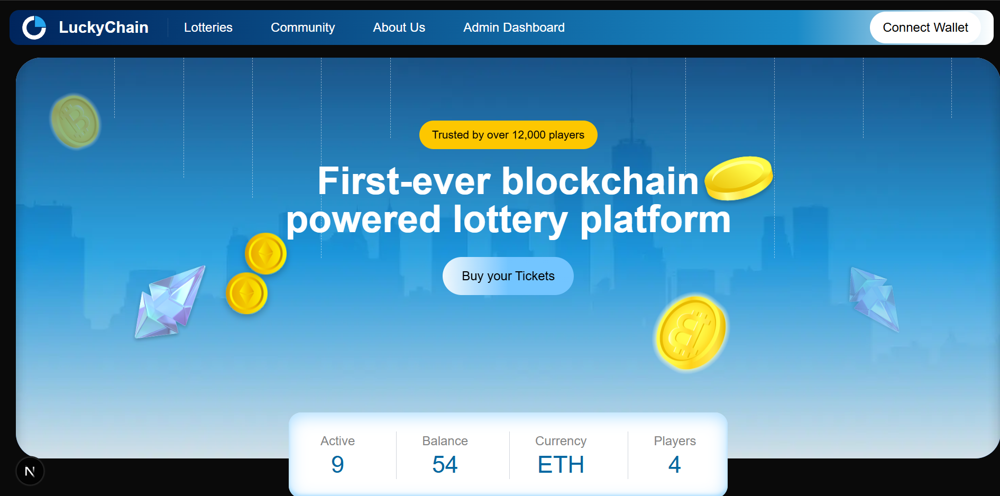
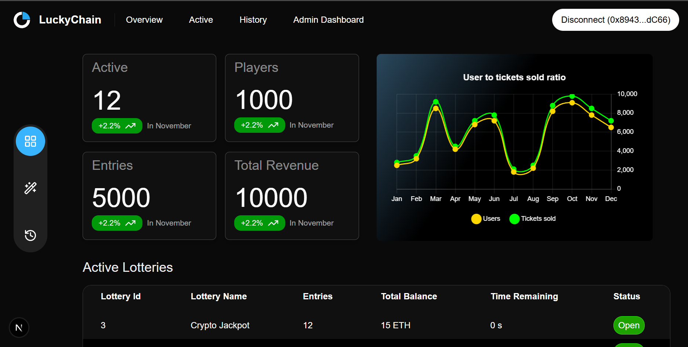

# Chainlink VRF Lottery / Raffle dApp (Foundry + Next.js + Supabase)

Full‑stack raffle platform where admins create multiple on‑chain raffles and users buy tickets. Winners are selected with Chainlink VRF v2.5, and Chainlink Automation triggers draws on a schedule. A Next.js dApp syncs on‑chain events into Supabase to power dashboards and history views.

**Recruiter summary:** This project demonstrates end‑to‑end Web3 product development: Solidity (Foundry) smart contracts + Chainlink VRF/Automation, a production-style Next.js App Router dApp (wagmi/viem + Zustand), and an off‑chain index layer (Supabase) for analytics and admin workflows.

## Screenshots




## What this project demonstrates

- Solidity raffle system with **weighted tickets** (more tickets = higher chance to win).
- **Chainlink VRF v2.5** randomness + **Chainlink Automation** for upkeep.
- Multi‑raffle factory that deploys and tracks raffle instances.
- Event-driven off‑chain sync to **Supabase** (raffles, ticket history, winners, revenue).
- Modern dApp stack: **Next.js App Router**, wagmi/viem, Zustand, Tailwind, Chart.js.
- Foundry scripts + unit/integration tests for reproducible deployments.

## Repo layout

| Path | Role |
| --- | --- |
| `src/` | Solidity contracts (`Raffle.sol`, `RaffleFactory.sol`). |
| `script/` | Foundry deployment + interaction scripts. |
| `test/` | Unit + integration tests + Chainlink mocks. |
| `userinterface/` | Primary Next.js dApp (landing, user flows, admin dashboard). |
| `frontend_old/` | Deprecated UI kept locally but ignored from Git. |
| `lib/` | Foundry deps (chainlink, forge-std, foundry-devops, solmate). |
| `Makefile`, `foundry.toml` | Common commands and Foundry config. |

## Smart contracts (high level)

- `RaffleFactory.sol`
  - Owner creates raffles (`CreateRaffle`) and maps ids/names to raffle addresses.
  - Registers a Chainlink Automation upkeep per raffle.
  - Manages VRF subscription lifecycle (create/fund/add consumer).
- `Raffle.sol`
  - Users enter by buying a **ticketCount**: `enterRaffle(uint256 ticketCount)`.
  - `checkUpkeep` becomes true when interval passes and the raffle has players + ETH.
  - `performUpkeep` requests randomness from VRF; `fulfillRandomWords` picks a weighted winner.
  - Payout: 10% owner fee, 90% winner payout.

## Quickstart (local)

### Prerequisites

- Foundry (`forge`, `cast`, `anvil`)
- Node.js 18+

### 1) Run contracts locally

```bash
make anvil
```

In a new terminal:

```bash
make deploy-anvil
```

### 2) Run tests

```bash
forge test
```

### 3) Run the dApp

```bash
cd userinterface
npm install
npm run dev
```

Open `http://localhost:3000`.

## Configuration

### UI environment variables

Create `userinterface/.env.local`:

```bash
NEXT_PUBLIC_SUPABASE_URL=
NEXT_PUBLIC_SUPABASE_ANON_KEY=
SUPABASE_SERVICE_ROLE_KEY=
```

### Contract + RPC config

- Update the on-chain addresses in `userinterface/src/lib/contractData.js` (factory address + ABIs).
- Update RPCs in `userinterface/src/lib/wagmiConfig.js` (currently includes a hard-coded Sepolia RPC and local Anvil).

## Sepolia deployment

If you want to deploy to Sepolia, set the required env vars in `.env` (repo root) and run:

```bash
make deploy-sepolia
```

## Notes for reviewers

- `frontend_old/` is intentionally ignored and not part of the maintained code path.
- `broadcast/`, `cache/`, `out/` contain local artifacts and script logs.
